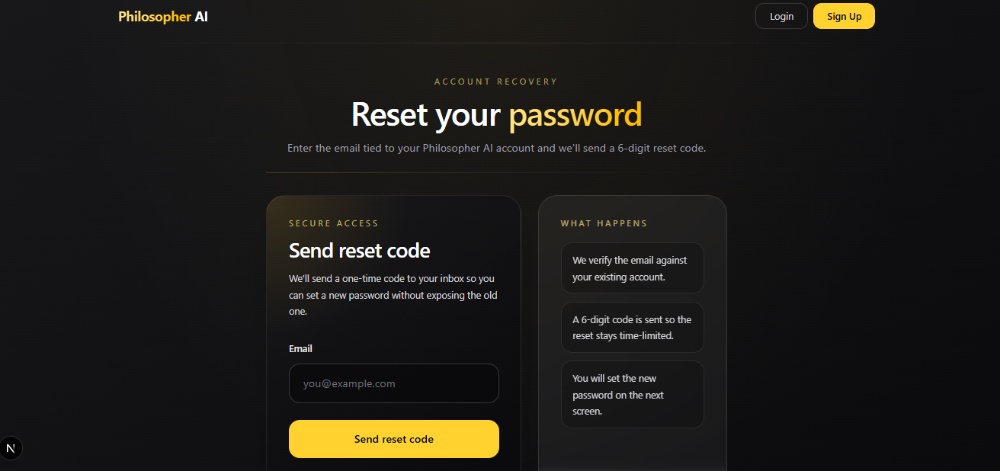
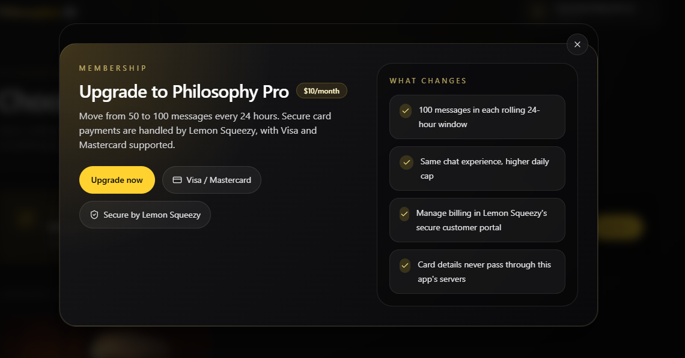
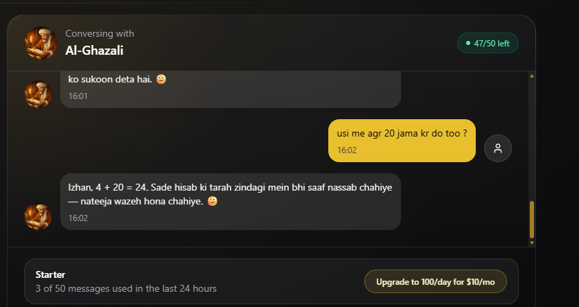

# Philosopher AI

Philosopher AI is a Next.js application for conversational experiences with historical philosophers. It combines account-based access, OTP-backed registration and password recovery, billing via Lemon Squeezy, and a chat interface with plan-based message limits.

## Product Tour

### Landing Page

The home page introduces the product, highlights the core value proposition, and gives users a fast entry into the app through Google sign-in or the standard auth flow.


### Password Recovery

The reset request screen follows the same visual language as the rest of the app while guiding the user through account recovery with a one-time reset code.



### Pro Upgrade Modal

Billing is presented inside a focused modal that explains the Pro plan, the higher daily message allowance, and the fact that secure payment handling is delegated to Lemon Squeezy.



### Context-Aware Chat

The main chat interface keeps each conversation scoped to the authenticated user and selected philosopher, and now sends recent message history so follow-up prompts can build on previous turns naturally.



## Stack

- Next.js App Router
- React 19
- TypeScript
- Prisma with MySQL
- NextAuth for Google sign-in
- Custom JWT access and refresh cookies for app authorization
- Lemon Squeezy for subscriptions and billing portal flows

## Core Flows

- Email/password signup with OTP verification
- Google sign-in bridged into app-specific auth cookies
- Login/logout with refresh-token based custom session handling
- Password recovery with OTP reset flow
- Billing checkout, portal access, and webhook-based subscription sync
- Message limits that depend on the user's billing status

## Project Structure

- `app/`: routes, pages, API handlers, and shared UI components
- `lib/`: auth, billing, Lemon Squeezy, Prisma, and mail helpers
- `prisma/`: schema, migrations, and generated Prisma client artifacts

## Environment Variables

Required values depend on which flows you want enabled, but the main set is:

```env
DATABASE_URL=
AUTH_SECRET=
JWT_SECRET=
REFRESH_JWT_SECRET=
GOOGLE_CLIENT_ID=
GOOGLE_CLIENT_SECRET=
LEMON_SQUEEZY_API_KEY=
LEMON_SQUEEZY_STORE_ID=
LEMON_SQUEEZY_VARIANT_ID=
LEMON_SQUEEZY_WEBHOOK_SECRET=
LEMON_SQUEEZY_TEST_MODE=
RESEND_API_KEY=
RESEND_FROM=
```

OTP and password reset emails are sent through Resend via [`sendGmail.ts`](C:\Users\izhan\Desktop\PhilosophyAi\my-app\lib\sendGmail.ts).

## Local Development

Install dependencies:

```bash
npm install
```

Generate the Prisma client if needed:

```bash
npx prisma generate
```

Run database migrations locally:

```bash
npx prisma migrate dev
```

Start the app:

```bash
npm run dev
```

## Production Notes

- Billing state is synchronized into the local `users` table from Lemon Squeezy webhooks.
- The webhook endpoint must be configured in Lemon Squeezy and use the same webhook secret as the app.
- The app currently uses both NextAuth and custom JWT cookies. Google sign-in depends on both layers working correctly.
- OTP and password-reset flows use rate limiting backed by database tables rather than in-memory counters.

## Recommended Next Improvements

- Add real-database integration coverage for the most critical auth and billing paths.
- Introduce structured logging instead of direct `console.*` usage in API routes.
- Consolidate the mixed auth model further so route protection and session ownership are easier to reason about.
